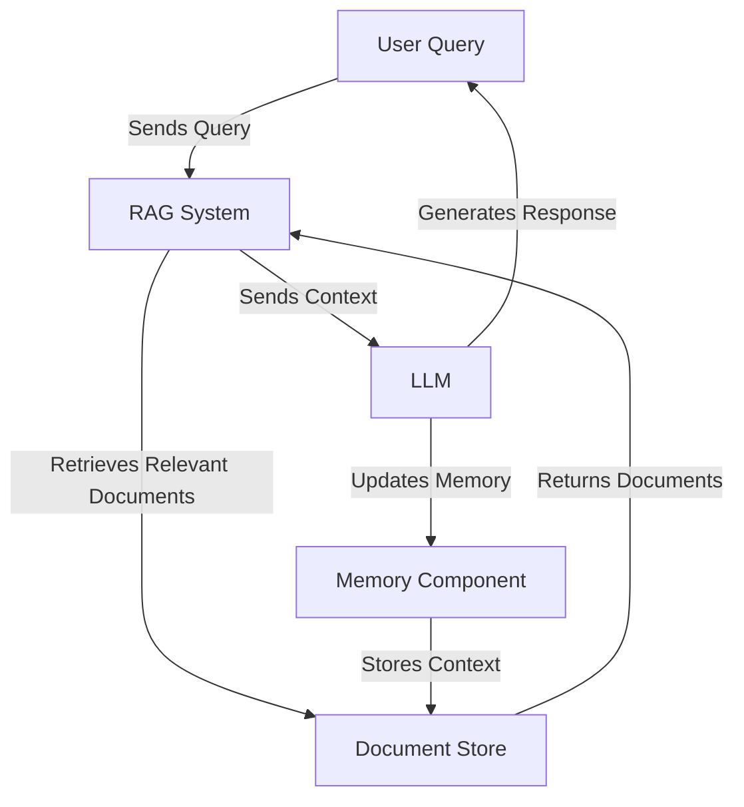

# AgentRAGProtocol

[](https://discord.gg/agora-999382051935506503) [](https://www.youtube.com/@kyegomez3242) [](https://www.linkedin.com/in/kye-g-38759a207/) [](https://x.com/kyegomezb)
[](https://github.com/The-Swarm-Corporation/Legal-Swarm-Template)
[](https://github.com/kyegomez/swarms)

## Overview

AgentRAGProtocol is an enterprise-grade framework that revolutionizes the integration of Retrieval-Augmented Generation (RAG) systems with AI agents. By providing a unified abstraction layer, it enables seamless multi-agent access to shared knowledge bases while maintaining context consistency and operational efficiency.

## Key Features

- **Unified Memory Interface**: Abstract implementation of RAG systems through a standardized MemoryWrapper
- **Multi-Agent Support**: Enables multiple agents to access and update shared knowledge bases
- **Enterprise-Ready**: Built for production environments with scalability in mind
- **Framework Agnostic**: Compatible with various LLM providers and vector stores
- **Type-Safe**: Implements strict typing for enhanced reliability
- **Extensible Architecture**: Easy to customize and extend for specific use cases

## Architecture

The AgentRAGProtocol implements a sophisticated multi-agent RAG system where multiple agents can interact with a shared knowledge base:



## Quick Start

### Installation

```bash
pip install swarms swarm-models swarm-memory
```

### Basic Usage

```python
from abc import ABC, abstractmethod
from swarms import Agent

class MemoryWrapper(ABC):
    @abstractmethod
    def add(self, doc: str):
        pass  # Abstract method for adding an item
    
    @abstractmethod
    def query(self, query: str):
        pass  # Abstract method for querying items

agent = Agent(
    long_term_memory=MemoryWrapper()
)
```

### Complete Implementation Example

```python
import os
from swarms import Agent
from swarm_models import OpenAIChat
from swarms_memory import ChromaDB
from dotenv import load_dotenv

# Environment setup
load_dotenv()
api_key = os.getenv("OPENAI_API_KEY")

# Initialize OpenAI model
model = OpenAIChat(
    openai_api_key=api_key,
    model_name="gpt-4o-mini",
    temperature=0.1
)

# Configure agent with RAG capabilities
agent = Agent(
    agent_name="Financial-Analysis-Agent",
    system_prompt="You're a financial analysis agent",
    llm=model,
    max_loops=1,
    autosave=True,
    dashboard=False,
    verbose=True,
    dynamic_temperature_enabled=True,
    saved_state_path="finance_agent.json",
    user_name="swarms_corp",
    retry_attempts=1,
    context_length=200000,
    return_step_meta=False,
    output_type="string",
    streaming_on=False,
    long_term_memory=ChromaDB()
)

# Execute query
agent.run(
    "How can I establish a ROTH IRA to buy stocks and get a tax break? What are the criteria"
)
```

```mermaid
graph LR
    A[Agent 1] -->|Own RAG|> A1[MemoryWrapper]
    B[Agent 2] -->|Own RAG|> B1[MemoryWrapper]
    C[Agent 3] -->|Own RAG|> C1[MemoryWrapper]
    A1 -->|Shared RAG|> D[Vector Store]
    B1 -->|Shared RAG|> D[Vector Store]
    C1 -->|Shared RAG|> D[Vector Store]
    D -->|Agent Interface|> E[Query Router]
    E -->|Context Manager|> D
    classDef shared fill:#f9f,stroke:#333,stroke-width:4px;
    class D shared;
    classDef own fill:#ccf,stroke:#f66,stroke-width:2px;
    class A1,B1,C1 own;

## Advanced Configuration

### Custom Memory Implementation

```python
class CustomMemory(MemoryWrapper):
    def add(self, doc: str):
        # Custom implementation for adding documents
        pass

    def query(self, query: str):
        # Custom implementation for querying documents
        pass
```

### Agent Configuration Options

```python
agent_config = {
    "max_loops": 1,
    "autosave": True,
    "dashboard": False,
    "verbose": True,
    "dynamic_temperature_enabled": True,
    "context_length": 200000,
    "streaming_on": False
}
```

## Performance Optimization

- Implement caching for frequently accessed documents
- Use batch processing for multiple queries
- Enable document compression for storage efficiency
- Implement query optimization strategies
- Configure appropriate vector store indexes

## Best Practices

1. Regular memory cleanup and optimization
2. Implement proper error handling
3. Monitor agent interactions
4. Set up logging and analytics
5. Regular backup of vector stores
6. Implementation of rate limiting
7. Security considerations for multi-agent access

## Contributing

We welcome contributions! Please see our [Contributing Guidelines](CONTRIBUTING.md) for details.

## License

This project is licensed under the MIT License. See the [LICENSE](LICENSE) file for details.

## Support

- [Discord Community](https://discord.gg/agora-999382051935506503)
- [Documentation](https://docs.swarms.ai)
- [GitHub Issues](https://github.com/kyegomez/swarms/issues)

## Connect With Us

- [LinkedIn](https://www.linkedin.com/in/kye-g-38759a207/)
- [YouTube](https://www.youtube.com/@kyegomez3242)
- [X.com](https://x.com/kyegomezb)

---

Built with ❤️ by the Swarms Team